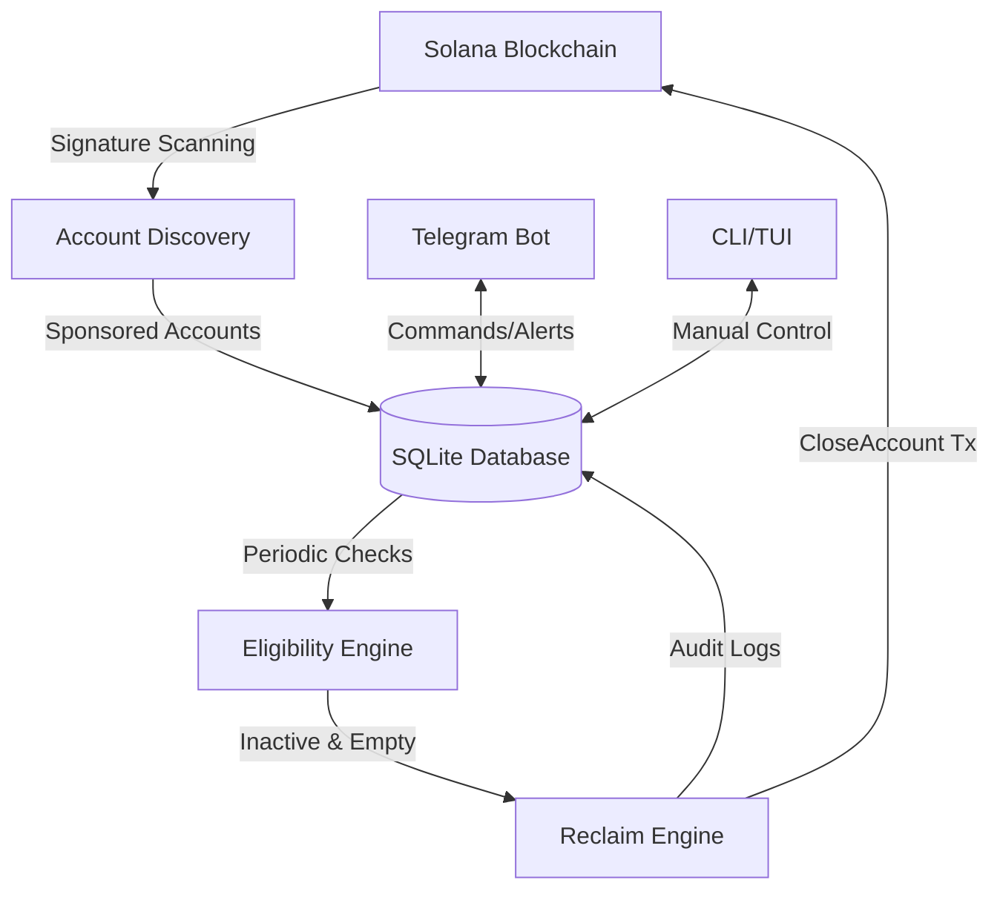

# Kora Rent-Reclaim Bot 🛡️

An automated solution for Kora operators to monitor, track, and reclaim rent-locked SOL from inactive sponsored accounts on Solana.

## 🌟 Overview

Kora makes it easy for applications to sponsor transactions and account creation on Solana, providing a seamless user experience. However, every time a Kora node sponsors the creation of an account (like an Associated Token Account), a small amount of SOL is locked as **rent**.

Over time, these accounts may become inactive, closed, or no longer needed. For operators, this represents a "silent capital loss" as funds remain locked in accounts that are no longer serving a purpose.

**Kora Rent-Reclaim Bot** solves this operational gap by:
1.  **Monitoring** all accounts ever sponsored by your Kora node.
2.  **Detecting** inactivity and eligibility for cleanup.
3.  **Reclaiming** locked rent SOL back to the operator's treasury.
4.  **Reporting** with clarity on where funds went and why they were reclaimed.

---

## 🧠 Understanding Solana Rent & Kora

To understand why this bot is necessary, we must dive into how Solana handles account storage and how Kora interacts with it.

### 1. What is Solana Rent?
On Solana, storing data on-chain requires "rent." To keep an account alive, it must maintain a minimum balance of SOL proportional to its data size. This is called the **Rent-Exempt Minimum**.
*   When an account is created, this SOL is "locked" in the account.
*   If the account is closed, this SOL is released to a designated destination address.

### 2. How Kora Sponsors Accounts
Kora acts as a "Fee Payer" for users. When a user needs a new account (e.g., to receive a specific token they don't yet have an account for), Kora:
1.  Signs the transaction as the fee payer.
2.  Provides the SOL required for the rent-exempt minimum of the new account.
3.  Creates the account on behalf of the user.

> [!IMPORTANT]
> Because Kora provides the initial SOL, that capital belongs to the Operator. However, once the account is created, the Operator often loses track of it.

### 3. The "Silent Capital Loss"
Many sponsored accounts (especially Associated Token Accounts or ATAs) are used briefly and then abandoned. 
*   A user might receive a promotional token and then move it elsewhere.
*   The account remains on-chain, holding ~0.002 SOL of the operator's money.
*   With thousands of users, this can lead to dozens or hundreds of SOL being "lost" in inactive accounts.

### 4. How Reclamation Works
This bot identifies accounts where the Operator is the **Close Authority** (common in Kora-sponsored SPL Token accounts) or where the account is simply empty and inactive. By sending a `CloseAccount` instruction, the bot triggers the Solana runtime to:
1.  Verify the account is eligible to be closed (e.g., zero token balance).
2.  Transfer the locked SOL balance back to the **Operator Treasury**.
3.  Remove the account from the Solana ledger.

---

## 🏗️ Architecture

The bot is built with a modular Rust-based architecture designed for safety, performance, and reliability.



### Core Components:
*   **Account Discovery (`src/solana/accounts.rs`)**: Scans the operator's transaction history to identify every account created or sponsored by the Kora node.
*   **Eligibility Engine (`src/reclaim/eligibility.rs`)**: Evaluates accounts based on custom inactivity periods, token balances, and reclamation strategies.
*   **Reclaim Engine (`src/reclaim/engine.rs`)**: Safely constructs and executes `CloseAccount` transactions to recover SOL.
*   **Storage Layer (`src/storage/db.rs`)**: Tracks account states (Active → Closed → Reclaimed) and provides a permanent audit trail of all recovered funds.

---

## 🚀 Core Features

### 1. Automated Monitoring & Discovery
The bot performs deep-signature scanning on your Operator address. It doesn't just look for active accounts; it traces back to the moment of creation to verify if Kora was the fee payer.
*   **Incremental Scanning**: Efficiently picks up where it left off using database checkpoints.
*   **Historical Discovery**: Can scan back through thousands of transactions to find long-lost rent.

### 2. Intelligent Eligibility Detection
Safety is the top priority. The bot uses multiple filters to ensure it never touches active accounts:
*   **Inactivity Filter**: Only accounts with no transaction activity for `N` days (configurable) are considered.
*   **Zero-Balance Verification**: For Token Accounts (ATAs), the bot verifies that the token balance is exactly zero before attempting to close.
*   **Type Awareness**: Automatically distinguishes between System accounts, SPL Token accounts, and permanent infrastructure like Mints (which are never reclaimed).

### 3. Safety & Controls
*   **Dry Run Mode**: See exactly what would be reclaimed without sending any transactions.
*   **Whitelists/Blacklists**: Explicitly exclude specific accounts or programs from being reclaimed.
*   **Close Authority**: Only attempts to reclaim accounts where the Operator has the required authority.

### 4. Detailed Reporting & Audit Trail
Every reclamation is logged in a local SQLite database, capturing:
*   Amount reclaimed in SOL/Lamports.
*   Transaction signature for the reclamation.
*   Exact reason why the account was eligible.
*   Timestamp of the action.

---

## 📱 Operator Interfaces

The bot provides two main interfaces for operators to manage their recovered funds.

### 1. Telegram Bot (Remote Management)
Perfect for monitoring on the go. The Telegram interface allows you to:
*   `/scan`: Trigger a scan for new sponsored accounts.
*   `/eligible`: Check which accounts are currently eligible for reclaim.
*   `/reclaimed`: View a list of recently reclaimed accounts.
*   `/stats`: Get a summary of total rent locked vs. reclaimed.
*   **Automatic Notifications**: Receive alerts whenever a cleanup action is performed.

### 2. Terminal User Interface (TUI)
For deep dives and manual control, the TUI provides a visual dashboard:
*   Real-time monitoring of account status.
*   Manual selection of accounts for reclamation.
*   Detailed view of account history and token balances.

---

## ⚙️ Installation & Setup

### Prerequisites
*   [Rust](https://rustup.rs/) (Stable)
*   SQLite 3

### 1. Clone the Repository
```bash
git clone https://github.com/SuperteamNG/korabot.git
cd korabot
```

### 2. Configuration
Copy the example configuration and fill in your details:
```bash
cp config.example.toml config.toml
```

Key configuration fields:
*   `operator_keypair_path`: Path to your Kora operator private key.
*   `treasury_address`: The Solana address where reclaimed SOL should be sent.
*   `min_inactive_days`: How long an account must be inactive before reclamation.

### 3. Run the Bot
```bash
cargo run --release
```

---

## 🛡️ Safety & Whitelisting

Operators can ensure critical accounts are never touched by adding them to the `whitelist` or `blacklist` in `config.toml`:

```toml
[reclaim]
whitelist = ["Pubkey1...", "Pubkey2..."] # Only reclaim these
blacklist = ["Pubkey3...", "Pubkey4..."] # Never reclaim these
```

---

## 📄 License

This project is fully open source under the MIT License. Built for the SuperteamNG Kora Bounty.
